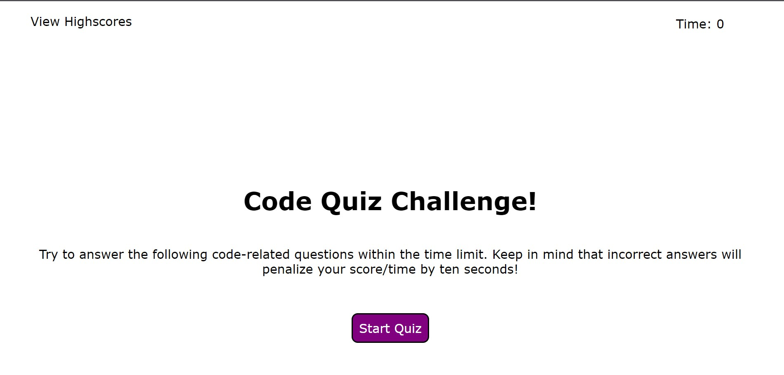
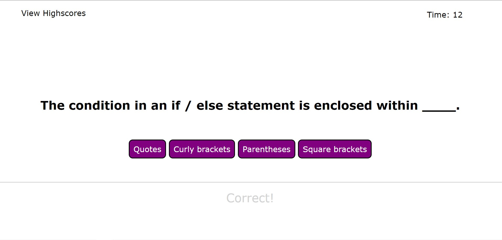
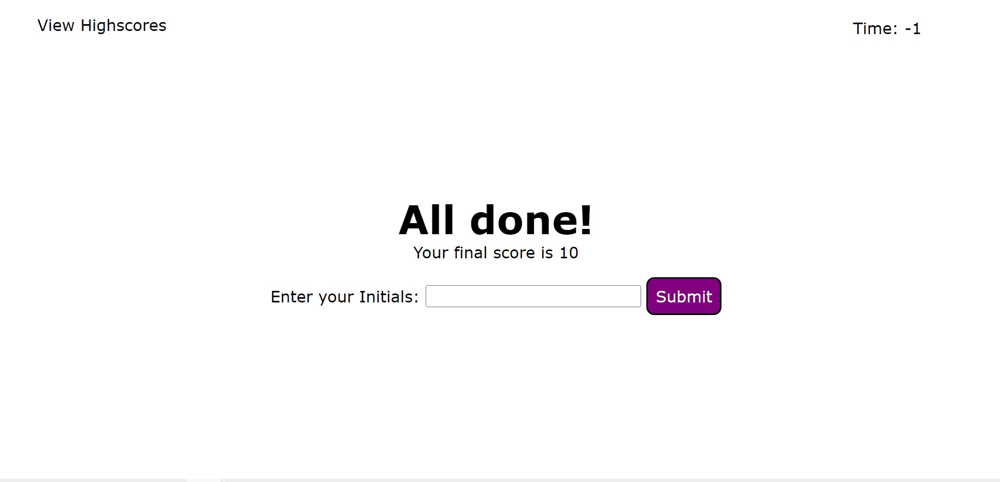

# Code Quiz Challenge Game
## Using Javascript and WebAPI
### Module 4 assignment- Create a quiz webpage using script and webAPIs
### The criteria the portfolio needed to meet are: 
### 1. When the "start quiz" button is pressed, a timer begins and questions appear.
### 2. After completing a question, another question appears.
### 3. When all questions or the timer reaches 0, the game ends.
### 4. Once the game is finished, an input appears to enter the users score.
### 5. All of the users scores is kept in local storage and shown in the "view high scores" directory.

 

### This assignment is an example of how to create functional buttons using javascript and web API techniques. The assignment shows the importance of techniques such as local storage and event listeners. 

 

# Webpage Image with working link
<!-- webpage link with image -->
### Link https://terrinmack.github.io/Code-Quiz-using-API/

 

# Installation 
* Created a simple html and css styling 
* Created a new repository on github with an html index, style.css, and script.js.
* Using mulitiple references on google, youtube, in class assignments and friends/tutors, attempted to create a somewhat functional script for the quiz game. 
* Ensured the webpage buttons all work accordingly. 

 

# Contact
### [Terri Mack](https://github.com/terrinmack?tab=repositories)